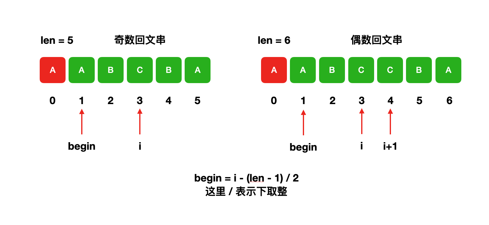

1. [✅ 141. 环形链表](#-141-环形链表)
2. [✅ 102. 二叉树的层序遍历](#-102-二叉树的层序遍历)
3. [✅ 121. 买卖股票的最佳时机](#-121-买卖股票的最佳时机)
4. [✅ 160. 相交链表](#-160-相交链表)
5. [✅ 88. 合并两个有序数组](#-88-合并两个有序数组)
6. [✅ 103. 二叉树的锯齿形层序遍历](#-103-二叉树的锯齿形层序遍历)
7. [✅ 20. 有效的括号](#-20-有效的括号)
8. [✅ 236. 二叉树的最近公共祖先](#-236-二叉树的最近公共祖先)
9. [✅ 5. 最长回文子串](#-5-最长回文子串)
10. [✅ 415. 字符串相加](#-415-字符串相加)


<!-- 
[141. 环形链表](https://leetcode-cn.com/problems/linked-list-cycle/)

[102. 二叉树的层序遍历](https://leetcode-cn.com/problems/binary-tree-level-order-traversal/)

[121. 买卖股票的最佳时机](https://leetcode-cn.com/problems/best-time-to-buy-and-sell-stock/)

[160. 相交链表](https://leetcode-cn.com/problems/intersection-of-two-linked-lists/)

[88. 合并两个有序数组](https://leetcode-cn.com/problems/merge-sorted-array/)

[103. 二叉树的锯齿形层序遍历](https://leetcode-cn.com/problems/binary-tree-zigzag-level-order-traversal/)

[20. 有效的括号](https://leetcode-cn.com/problems/valid-parentheses/)

[236. 二叉树的最近公共祖先](https://leetcode-cn.com/problems/lowest-common-ancestor-of-a-binary-tree/)

[5. 最长回文子串](https://leetcode-cn.com/problems/longest-palindromic-substring/)

[415. 字符串相加](https://leetcode-cn.com/problems/add-strings/)

-->

---


## ✅ [141. 环形链表](https://leetcode-cn.com/problems/linked-list-cycle/)


```go
func hasCycle(head *ListNode) bool {
	if head == nil || head.Next == nil {
		return false
	}
	slow, fast := head, head.Next
	for slow != fast {
		if fast == nil || fast.Next == nil {
			return false
		}
		slow = slow.Next
		fast = fast.Next.Next
	}
	return true
}
```


[参考](https://leetcode-cn.com/problems/linked-list-cycle/solution/huan-xing-lian-biao-by-leetcode-solution/)


## ✅ [102. 二叉树的层序遍历](https://leetcode-cn.com/problems/binary-tree-level-order-traversal/)

**方法一：DFS递归**

```go
var res [][]int

func levelOrder(root *TreeNode) [][]int {
	res = [][]int{}
	dfs(root, 0)
	return res
}
func dfs(root *TreeNode, level int) {
	if root != nil {
		if level == len(res) {
			res = append(res, []int{})
		}
		res[level] = append(res[level], root.Val)
		dfs(root.Left, level+1)
		dfs(root.Right, level+1)
	}
```

复杂度分析

- 时间复杂度：O(N)，其中 N 是二叉树的节点数。二叉树的所有节点有且只会被访问一次，因此时间复杂度为 O(N)。
- 空间复杂度：O(N) ，其中 N 是二叉树的节点数。递归调用的栈深度取决于二叉树的高度，二叉树最坏情况下为一条链，此时高度为 N，因此空间复杂度为 O(N)。


**方法二：BFS(queue)迭代**

```go
func levelOrder(root *TreeNode) [][]int {
	res := [][]int{}
	if root == nil {
		return res
	}
	queue := []*TreeNode{root}
	for level := 0; 0 < len(queue); level++ {
		res = append(res, []int{})
		next := []*TreeNode{}
		for j := 0; j < len(queue); j++ {
			node := queue[j]
			res[level] = append(res[level], node.Val)
			if node.Left != nil {
				next = append(next, node.Left)
			}
			if node.Right != nil {
				next = append(next, node.Right)
			}
		}
		queue = next
	}
	return res
}
```


复杂度分析

记树上所有节点的个数为 n。

- 时间复杂度：每个点进队出队各一次，故渐进时间复杂度为 O(n)。
- 空间复杂度：队列中元素的个数不超过 n 个，故渐进空间复杂度为 O(n)。


## ✅ [121. 买卖股票的最佳时机](https://leetcode-cn.com/problems/best-time-to-buy-and-sell-stock/)


```go
func maxProfit(prices []int) int {
	min_price, max_profit := math.MaxInt64, 0
	for _, price := range prices {
		if price < min_price { 
			min_price = price
		} else if max_profit < price-min_price {
			max_profit = price - min_price 
		}
	}
	return max_profit
}
```


```go
func maxProfit(prices []int) int {
	min_price, max_profit := 1<<63-1, 0
	for _,price := range prices {
		min_price = min(min_price, price)
		max_profit = max(max_profit, price - min_price)
	}
	return max_profit
}
func min(x, y int) int {
	if x < y {
		return x
	}
	return y
}
func max(x, y int) int {
	if x > y {
		return x
	}
	return y
}
```


## ✅ [160. 相交链表](https://leetcode-cn.com/problems/intersection-of-two-linked-lists/)

**方法一：双指针法**


```go
/**
 * Definition for singly-linked list.
 * type ListNode struct {
 *     Val int
 *     Next *ListNode
 * }
 */
func getIntersectionNode(headA, headB *ListNode) *ListNode {
	if headA == nil || headB == nil {
		return nil
	}
	A, B := headA, headB
	for A != B {
		if A != nil {
			A = A.Next
		} else {
			A = headB
		}
		if B != nil {
			B = B.Next
		} else {
			B = headA
		}
	}
	return A
}
```

复杂度分析

- 时间复杂度 : O(m+n)。
- 空间复杂度 : O(1)。

[参考](https://leetcode-cn.com/problems/intersection-of-two-linked-lists/solution/intersection-of-two-linked-lists-shuang-zhi-zhen-l/)


## ✅ [88. 合并两个有序数组](https://leetcode-cn.com/problems/merge-sorted-array/)

**方法一：逆向双指针**

```go
func merge(nums1 []int, m int, nums2 []int, n int) {
	i, j := m-1, n-1
	for tail := m + n - 1; tail >= 0; tail-- {
		if j < 0 || (i >= 0 && nums1[i] > nums2[j]) {
			nums1[tail] = nums1[i]
			i--
		} else {
			nums1[tail] = nums2[j]
			j--
		}
	}
}
```

复杂度分析

- 时间复杂度：O(m+n)。
  指针移动单调递减，最多移动 m+n 次，因此时间复杂度为 O(m+n)。
- 空间复杂度：O(1)。 
  直接对数组 nums 1 原地修改，不需要额外空间。


## ✅ [103. 二叉树的锯齿形层序遍历](https://leetcode-cn.com/problems/binary-tree-zigzag-level-order-traversal/)

**方法一：深度优先遍历**

```go
var res [][]int

func zigzagLevelOrder(root *TreeNode) [][]int {
	res = [][]int{}
	dfs(root, 0)
	return res
}
func dfs(root *TreeNode, level int) {
	if root != nil {
		if len(res) == level {
			res = append(res, []int{})
		}
		if level%2 == 0 {//偶数层，从左往右
			res[level] = append(res[level], root.Val)
		} else {//奇数层，从右往左
			res[level] = append([]int{root.Val}, res[level]...)
		}
		dfs(root.Left, level+1)
		dfs(root.Right, level+1)
	}
}
```

**闭包**

```go
/**
 * Definition for a binary tree node.
 * type TreeNode struct {
 *     Val int
 *     Left *TreeNode
 *     Right *TreeNode
 * }
 */
func zigzagLevelOrder(root *TreeNode) [][]int {
	res := [][]int{}
	var dfs func(*TreeNode, int)// 闭包
	dfs = func(root *TreeNode, level int) {
		if root != nil {
			if len(res) == level {
				res = append(res, []int{})
			}
			if level%2 == 0 {
				res[level] = append(res[level], root.Val)
			} else {//翻转奇数层的元素
				res[level] = append([]int{root.Val}, res[level]...)
			}
			dfs(root.Left, level+1)
			dfs(root.Right, level+1)
		}
	}
	dfs(root, 0)
	return res
}
```

**方法二：广度优先遍历**

```go
/**
 * Definition for a binary tree node.
 * type TreeNode struct {
 *     Val int
 *     Left *TreeNode
 *     Right *TreeNode
 * }
 */
func zigzagLevelOrder(root *TreeNode) [][]int {
	res := [][]int{}
	if root == nil {
		return res
	}
	queue := []*TreeNode{root}
	for level := 0; len(queue) > 0; level++ {
		res = append(res, []int{})
		next, q := []int{}, queue
		queue = nil
		for _, node := range q {
			next = append(next, node.Val)
			if node.Left != nil {
				queue = append(queue, node.Left)
			}
			if node.Right != nil {
				queue = append(queue, node.Right)
			}
		}
		if level%2 == 1 { //翻转奇数层的元素
			for i, n := 0, len(next); i < n/2; i++ {
				next[i], next[n-1-i] = next[n-1-i], next[i]
			}
		}
		res[level] = append(res[level], next...)
	}
	return res
}
```


## ✅ [20. 有效的括号](https://leetcode-cn.com/problems/valid-parentheses/)

```go
func isValid(s string) bool {
	if len(s) == 0 {
		return true
	}
	stack := make([]rune, 0)
	for _, v := range s {
		if v == '(' || v == '{' || v == '[' {
			stack = append(stack, v) //入栈
		} else if len(stack) > 0 && stack[len(stack)-1] == '(' && v == ')' ||
			len(stack) > 0 && stack[len(stack)-1] == '{' && v == '}' ||
			len(stack) > 0 && stack[len(stack)-1] == '[' && v == ']' {
			stack = stack[:len(stack)-1] //出栈
		} else {
			return false
		}
	}
	return len(stack) == 0
}
```


## ✅ [236. 二叉树的最近公共祖先](https://leetcode-cn.com/problems/lowest-common-ancestor-of-a-binary-tree/)


```go
/**
 * Definition for a binary tree node.
 * type TreeNode struct {
 *     Val int
 *     Left *TreeNode
 *     Right *TreeNode
 * }
 */
func lowestCommonAncestor(root, p, q *TreeNode) *TreeNode {
	if root == nil {
		return nil
	}
	if root.Val == p.Val || root.Val == q.Val { //递归出口
		return root
	} //判断左子树、右子树是否包含 p、q
	left := lowestCommonAncestor(root.Left, p, q)
	right := lowestCommonAncestor(root.Right, p, q)
	if left != nil && right != nil {
		return root
	}
	if left == nil {
		return right
	} else {
		return left
	}
}
```


复杂度分析

- 时间复杂度：O(N)，其中 N 是二叉树的节点数。二叉树的所有节点有且只会被访问一次，因此时间复杂度为 O(N)。
- 空间复杂度：O(N) ，其中 N 是二叉树的节点数。递归调用的栈深度取决于二叉树的高度，二叉树最坏情况下为一条链，此时高度为 N，因此空间复杂度为 O(N)。


[参考](https://leetcode-cn.com/problems/lowest-common-ancestor-of-a-binary-tree/solution/er-cha-shu-de-zui-jin-gong-gong-zu-xian-by-leetc-2/)


## ✅ [5. 最长回文子串](https://leetcode-cn.com/problems/longest-palindromic-substring/)

**方法一：（暴力枚举） O(n^2)**

由于字符串长度小于1000，因此我们可以用 O(n^2)的算法枚举所有可能的情况。
首先枚举回文串的中心 i，然后分两种情况向两边扩展边界，直到遇到不同字符为止:

- 回文串长度是奇数，则依次判断 s[i−k]==s[i+k],k=1,2,3,…
- 回文串长度是偶数，则依次判断 s[i−k]==s[i+k−1],k=1,2,3,…
如果遇到不同字符，则我们就找到了以 i 为中心的回文串边界。

时间复杂度分析：一共两重循环，所以时间复杂度是 O(n^2)


```go
func longestPalindrome(s string) string {
	res, n := "", len(s)
	for i := 0; i < n; i++ { // n 为奇数
		for l, r := i, i; l >= 0 && r < n && s[l] == s[r]; l, r = l-1, r+1 {
			if len(res) < r-l+1 {
				res = s[l : r+1]
			}
		}
	}
	for i := 0; i < n; i++ { // n 为欧数
		for l, r := i, i+1; l >= 0 && r < n && s[l] == s[r]; l, r = l-1, r+1 {
			if len(res) < r-l+1 {
				res = s[l : r+1]
			}
		}
	}
	return res
}
```
复杂度分析

- 时间复杂度：O(n^2)，其中 n 是字符串的长度。长度为 1 和 2 的回文中心分别有 n 和 n−1 个，每个回文中心最多会向外扩展 O(n) 次。
- 空间复杂度：O(n)。

**方法二：中心扩展算法**



```go
func longestPalindrome(s string) string {
	start, end := 0, 0
	for i := range s {
		l, r := expend(s, i, i) // n 为奇数
		if end-start < r-l {
			start, end = l, r
		}
		l, r = expend(s, i, i+1) // n 为欧数
		if end-start < r-l {
			start, end = l, r
		}
	}
	return s[start : end+1]
}
func expend(s string, l, r int) (int, int) {
	for ; l >= 0 && r < len(s) && s[l] == s[r]; l, r = l-1, r+1 {
	}
	return l + 1, r - 1
}
```
复杂度分析

- 时间复杂度：O(n^2)，其中 n 是字符串的长度。长度为 1 和 2 的回文中心分别有 n 和 n−1 个，每个回文中心最多会向外扩展 O(n) 次。
- 空间复杂度：O(1)。


## ✅ [415. 字符串相加](https://leetcode-cn.com/problems/add-strings/)


**方法一：模拟**
- 对两个大整数模拟「竖式加法」的过程，将相同数位对齐，
- 从低到高逐位相加，如果当前位和超过 10，则向高位进一位。


```go
func addStrings(num1 string, num2 string) string {
	res, carry := "", 0
	for i, j := len(num1)-1, len(num2)-1; i >= 0 || j >= 0 || carry != 0; i, j = i-1, j-1 {
		var x, y int
		if i >= 0 {
			x = int(num1[i] - '0') // 字符串转整数
		}
		if j >= 0 {
			y = int(num2[j] - '0') // 字符串转整数
		}
		tmp := x + y + carry
		res = strconv.Itoa(tmp%10) + res // 取个位，整数转字符串，从低到高逐位相加
		carry = tmp / 10                 // 取十位
	}
	return res
}
```


[参考](https://leetcode-cn.com/problems/add-strings/solution/zi-fu-chuan-xiang-jia-by-leetcode-solution/)


