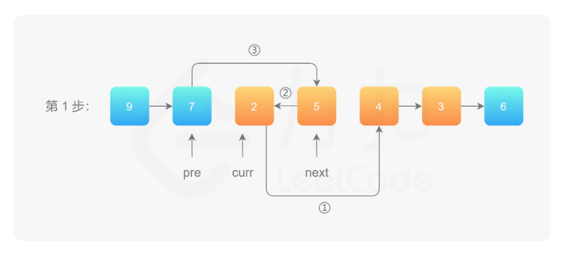

2023-01-30 05:18:39

1. [46. 全排列](#46-全排列)
2. [47. 全排列 II  补充](#47-全排列-ii--补充)
3. [160. 相交链表](#160-相交链表)
4. [54. 螺旋矩阵](#54-螺旋矩阵)
5. [23. 合并K个升序链表](#23-合并k个升序链表)
6. [92. 反转链表 II](#92-反转链表-ii)
7. [415. 字符串相加](#415-字符串相加)
8. [142. 环形链表 II](#142-环形链表-ii)
9. [300. 最长递增子序列](#300-最长递增子序列)
10. [42. 接雨水](#42-接雨水)
11. [143. 重排链表](#143-重排链表)


## [46. 全排列](https://leetcode-cn.com/problems/permutations/)

**枚举每个位置，填每个数 (回溯)**

```go
func permute(nums []int) [][]int {
	res, path, used, n := [][]int{}, []int{}, make([]bool, len(nums)), len(nums)
	var dfs func(int)
	
	dfs = func(pos int) { // 枚举位置
		if len(path) == n {
			res = append(res, append([]int{}, path...)) // path append后会扩容，消除前面的无效数据(0)
			return
		}
		for i := 0; i < n; i++ { // 枚举所有的选择
			if !used[i] {        // 第i个位置未使用
				used[i] = true               // 第i个位置已使用
				path = append(path, nums[i]) // 做出选择，记录路径
				dfs(pos + 1)                 // 枚举下一个位置
				used[i] = false              // 撤销选择
				path = path[:len(path)-1]    // 取消记录
			}
		}
	}

	dfs(0)
	return res
}
```

```go
func permute(nums []int) [][]int {
	res, n := [][]int{}, len(nums)
	var dfs func(int)

	dfs = func(pos int) {
		if pos == n { // 所有位置都已填满
			res = append(res, append([]int{}, nums...))
			return // 结束递归
		}
		for i := pos; i < len(nums); i++ {
			nums[pos], nums[i] = nums[i], nums[pos] // pos 位置填入 nums[i]
			dfs(pos + 1)                            // 递归填下一个位置
			nums[pos], nums[i] = nums[i], nums[pos] //撤销、回溯
		}
	}

	dfs(0)
	return res
}
```


## [47. 全排列 II](https://leetcode-cn.com/problems/permutations-ii/)  补充

```go
func permuteUnique(nums []int) [][]int {
	sort.Ints(nums)
	used, res, path := make([]bool, len(nums)), [][]int{}, []int{}
	var dfs func(int)

	dfs = func(pos int) {
		if len(path) == len(nums) {
			res = append(res, append([]int{}, path...))
			return
		}
		for i := 0; i < len(nums); i++ {
			if used[i] || i > 0 && !used[i-1] && nums[i-1] == nums[i] { // 已使用 或 重复
				continue // 去重，跳过
			}
			used[i] = true
			path = append(path, nums[i])
			dfs(pos + 1)
			used[i] = false
			path = path[:len(path)-1]
		}
	}

	dfs(0)
	return res
}
```

## [160. 相交链表](https://leetcode-cn.com/problems/intersection-of-two-linked-lists/)

```go
/**
 * Definition for singly-linked list.
 * type ListNode struct {
 *     Val int
 *     Next *ListNode
 * }
 */
func getIntersectionNode(headA, headB *ListNode) *ListNode {
	if headA == nil || headB == nil {
		return nil
	}
	A, B := headA, headB
	for A != B {
		if A != nil {
			A = A.Next
		} else {
			A = headB
		}
		if B != nil {
			B = B.Next
		} else {
			B = headA
		}
	}
	return A
}
```

2023-02-01 05:08:29

## [54. 螺旋矩阵](https://leetcode-cn.com/problems/spiral-matrix/)

```go
func spiralOrder(matrix [][]int) (res []int) {
	if len(matrix) == 0 {
		return []int{}
	}
	top, bottom, left, right := 0, len(matrix)-1, 0, len(matrix[0])-1
	for top <= bottom && left <= right {
		for i := left; i <= right; i++ {
			res = append(res, matrix[top][i])
		}
		top++
		for i := top; i <= bottom; i++ {
			res = append(res, matrix[i][right])
		}
		right--
		if top > bottom || left > right {
			break
		}
		for i := right; i >= left; i-- {
			res = append(res, matrix[bottom][i])
		}
		bottom--
		for i := bottom; i >= top; i-- {
			res = append(res, matrix[i][left])
		}
		left++
	}
	return res
}
```

## [23. 合并K个升序链表](https://leetcode-cn.com/problems/merge-k-sorted-lists/)

```go
/**
 * Definition for singly-linked list.
 * type ListNode struct {
 *     Val int
 *     Next *ListNode
 * }
 */
func mergeKLists(lists []*ListNode) *ListNode {
	n := len(lists)
	if n == 0 {
		return nil
	}
	if n == 1 {
		return lists[0]
	}
	mid := n >> 1
	left, right := mergeKLists(lists[:mid]), mergeKLists(lists[mid:])
	return mergeTwoList(left, right)
}
func mergeTwoList(l1, l2 *ListNode) *ListNode {
	if l1 == nil {
		return l2
	}
	if l2 == nil {
		return l1
	}
	if l1.Val < l2.Val {
		l1.Next = mergeTwoList(l1.Next, l2)
		return l1
	} else {
		l2.Next = mergeTwoList(l1, l2.Next)
		return l2
	}
}
```

## [92. 反转链表 II](https://leetcode-cn.com/problems/reverse-linked-list-ii/)

- curr：指向待反转区域的第一个节点 left；
- next：永远指向 curr 的下一个节点，循环过程中，curr 变化以后 next 会变化；
- pre：永远指向待反转区域的第一个节点 left 的前一个节点，在循环过程中不变。




```go
/**
 * Definition for singly-linked list.
 * type ListNode struct {
 *     Val int
 *     Next *ListNode
 * }
 */
func reverseBetween(head *ListNode, left int, right int) *ListNode {
	dummy := &ListNode{Next: head}
	pre := dummy
	for i := 0; i < left-1; i++ {
		pre = pre.Next
	}
	cur := pre.Next
	for i := 0; i < right-left; i++ {
		next := cur.Next
		cur.Next = next.Next
		next.Next = pre.Next // 头插
		pre.Next = next
	}
	return dummy.Next
}
```

## [415. 字符串相加](https://leetcode.cn/problems/add-strings/)

```go
func addStrings(num1 string, num2 string) string {
	res, carry := "", 0
	for i, j := len(num1)-1, len(num2)-1; i >= 0 || j >= 0 || carry != 0; i, j = i-1, j-1 {
		var x, y int
		if i >= 0 {
			x = int(num1[i] - '0')
		}
		if j >= 0 {
			y = int(num2[j] - '0')
		}
		temp := x + y + carry // 必须加进位
		res = strconv.Itoa(temp%10) + res
		carry = temp / 10
	}
	return res
}
```

## [142. 环形链表 II](https://leetcode-cn.com/problems/linked-list-cycle-ii/)

```go
/**
 * Definition for singly-linked list.
 * type ListNode struct {
 *     Val int
 *     Next *ListNode
 * }
 */
func detectCycle(head *ListNode) *ListNode {
	slow, fast := head, head
	for fast != nil {
		slow = slow.Next
		if fast.Next == nil {
			return nil
		}
		fast = fast.Next.Next
		if slow == fast {
			p := head
			for p != slow {
				p = p.Next
				slow = slow.Next
			}
			return p
		}
	}
	return nil
}
```

```go
/**
 * Definition for singly-linked list.
 * type ListNode struct {
 *     Val int
 *     Next *ListNode
 * }
 */
func detectCycle(head *ListNode) *ListNode {
	slow, fast := head, head
	for {
		if fast == nil || fast.Next == nil {
			return nil
		}
		fast = fast.Next.Next
		slow = slow.Next
		if slow == fast {
			break
		}
	}
	fast = head
	for slow != fast {
		slow = slow.Next
		fast = fast.Next
	}
	return fast
}
```
## [300. 最长递增子序列](https://leetcode-cn.com/problems/longest-increasing-subsequence/)


## [42. 接雨水](https://leetcode-cn.com/problems/trapping-rain-water/)

## [143. 重排链表](https://leetcode.cn/problems/reorder-list/)

