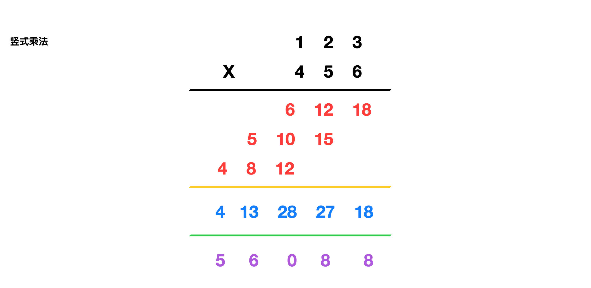

1. [129. 求根节点到叶节点数字之和](#129-求根节点到叶节点数字之和)
2. [43. 字符串相乘](#43-字符串相乘)
3. [165. 比较版本号](#165-比较版本号)
4. [78. 子集](#78-子集)
5. [32. 最长有效括号](#32-最长有效括号)
6. [113. 路径总和 II](#113-路径总和-ii)
7. [101. 对称二叉树](#101-对称二叉树)
8. [543. 二叉树的直径](#543-二叉树的直径)
9. [98. 验证二叉搜索树](#98-验证二叉搜索树)
10. [64. 最小路径和](#64-最小路径和)
11. [470. 用 Rand7() 实现 Rand10()](#470-用-rand7-实现-rand10)
12. [112. 路径总和](#112-路径总和)
13. [234. 回文链表 -->](#234-回文链表---)
14. [39. 组合总和](#39-组合总和)
15. [169. 多数元素](#169-多数元素)
16. [48. 旋转图像](#48-旋转图像)
17. [718. 最长重复子数组](#718-最长重复子数组)
18. [221. 最大正方形](#221-最大正方形)
19. [226. 翻转二叉树](#226-翻转二叉树)
20. [34. 在排序数组中查找元素的第一个和最后一个位置](#34-在排序数组中查找元素的第一个和最后一个位置)


<!-- [129. 求根节点到叶节点数字之和](https://leetcode-cn.com/problems/sum-root-to-leaf-numbers/)


[165. 比较版本号](https://leetcode-cn.com/problems/compare-version-numbers/)


[78. 子集](https://leetcode-cn.com/problems/subsets/)


[43. 字符串相乘](https://leetcode.cn/problems/multiply-strings/)

[32. 最长有效括号](https://leetcode.cn/problems/longest-valid-parentheses/)

[113. 路径总和 II](https://leetcode-cn.com/problems/path-sum-ii/)

[101. 对称二叉树](https://leetcode-cn.com/problems/symmetric-tree/)

[98. 验证二叉搜索树](https://leetcode-cn.com/problems/validate-binary-search-tree/)

[543. 二叉树的直径](https://leetcode-cn.com/problems/diameter-of-binary-tree/)


[64. 最小路径和](https://leetcode-cn.com/problems/minimum-path-sum/) 


[26. 删除有序数组中的重复项](https://leetcode.cn/problems/remove-duplicates-from-sorted-array/)


[22. 括号生成](https://leetcode-cn.com/problems/generate-parentheses/)


[470. 用 Rand7() 实现 Rand10()](https://leetcode-cn.com/problems/implement-rand10-using-rand7/)


[718. 最长重复子数组](https://leetcode-cn.com/problems/maximum-length-of-repeated-subarray/)


[112. 路径总和](https://leetcode-cn.com/problems/path-sum/)

[48. 旋转图像](https://leetcode-cn.com/problems/rotate-image/)

[234. 回文链表](https://leetcode-cn.com/problems/palindrome-linked-list/) -->


-->


## [129. 求根节点到叶节点数字之和](https://leetcode-cn.com/problems/sum-root-to-leaf-numbers/)

```go
/**
 * Definition for a binary tree node.
 * type TreeNode struct {
 *     Val int
 *     Left *TreeNode
 *     Right *TreeNode
 * }
 */
func sumNumbers(root *TreeNode) int {
	return dfs(root, 0)
}
func dfs(root *TreeNode, prevSum int) int {
	if root == nil {
		return 0
	}
	sum := prevSum*10 + root.Val
	if root.Left == nil && root.Right == nil {
		return sum
	}
	return dfs(root.Left, sum) + dfs(root.Right, sum)
}
```


## [43. 字符串相乘](https://leetcode.cn/problems/multiply-strings/)



```go
func multiply(num1 string, num2 string) string {
	if num1 == "0" || num2 == "0" {
		return "0"
	}
	m, n := len(num1), len(num2)
	A := make([]int, m+n)
	for i := m - 1; i >= 0; i-- {
		x := int(num1[i] - '0')
		for j := n - 1; j >= 0; j-- {
			y := int(num2[j] - '0')
			A[i+j+1] += x * y // 竖式乘法，只累加但不进位
		}
	}
	for i := m + n - 1; i > 0; i-- {
		A[i-1] += A[i] / 10 // 进位
		A[i] %= 10          // 个位
	}
	res, i := "", 0
	if A[0] == 0 { // 去除前导0
		i = 1
	}
	for ; i < m+n; i++ {
		res += strconv.Itoa(A[i]) //整数转字符串、拼接
	}
	return res
}
```

[参考视频](https://www.bilibili.com/video/BV1ba4y1J7yh)

## [165. 比较版本号](https://leetcode-cn.com/problems/compare-version-numbers/)


```go
func compareVersion(version1 string, version2 string) int {
	i, j, m, n := 0, 0, len(version1), len(version2)
	for i < m || j < n {
		x := 0
		for ; i < m && version1[i] != '.'; i++ {
			x = x*10 + int(version1[i]-'0')
		}
		i++ // 跳过点号
		y := 0
		for ; j < n && version2[j] != '.'; j++ {
			y = y*10 + int(version2[j]-'0')
		}
		j++ // 跳过点号
		if x > y {
			return 1
		}
		if x < y {
			return -1
		}
	}
	return 0
}
```

## [78. 子集](https://leetcode-cn.com/problems/subsets/)

```go
func subsets(nums []int) (res [][]int) {
	n := len(nums)
	for mask := 0; mask < 1<<n; mask++ { // mask 从 000 到 111
		set := []int{}
		for i, v := range nums {
			if mask>>i&1 == 1 { // mask 的第 i 位是否为1
				set = append(set, v)
			}
		}
		res = append(res, set)
	}
	return
}
```

```go
func subsets(nums []int) [][]int {
	res, set := [][]int{}, []int{}
	var dfs func(int)

	dfs = func(i int) {
		if i == len(nums) { // 指针越界
			res = append(res, append([]int(nil), set...)) // 加入解集
			return                                        // 结束当前的递归
		}
		set = append(set, nums[i]) //选择这个数
		dfs(i + 1)                 // 基于该选择，继续往下递归，考察下一个数
		set = set[:len(set)-1]     // 上面的递归结束，撤销该选择
		dfs(i + 1)                 // 不选这个数，继续往下递归，考察下一个数
	}

	dfs(0)
	return res
}
```

```go
func subsets(nums []int) [][]int {
	res, set := [][]int{}, []int{}
	var dfs func(int)

	dfs = func(i int) {
		res = append(res, append([]int(nil), set...)) // 调用子递归前，加入解集
		for j := i; j < len(nums); j++ {              // 枚举出所有可选的数
			set = append(set, nums[j]) // 选这个数
			dfs(j + 1)                 // 基于选这个数，继续递归，传入的j+1，不是i+1
			set = set[:len(set)-1]     // 撤销选这个数
		}
	}

	dfs(0)
	return res
}
```


## [32. 最长有效括号](https://leetcode.cn/problems/longest-valid-parentheses/)

**方法三：正序+逆序遍历,不需要额外的空间**

```go
func longestValidParentheses(s string) int {
	left, right, maxLength, n := 0, 0, 0, len(s)
	for i := 0; i < n; i++ { // 正序遍历
		if s[i] == '(' {
			left++
		} else {
			right++
		}
		if left == right {
			maxLength = max(maxLength, 2*left)
		} else if right > left {
			left, right = 0, 0
		}
	}
	left, right = 0, 0
	for i := n - 1; i >= 0; i-- { // 逆序遍历
		if s[i] == '(' {
			left++
		} else {
			right++
		}
		if left == right {
			maxLength = max(maxLength, 2*left)
		} else if right < left {
			left, right = 0, 0
		}
	}
	return maxLength
}
func max(x, y int) int {
	if x > y {
		return x
	}
	return y
}
```

[参考](https://leetcode.cn/problems/longest-valid-parentheses/solution/zui-chang-you-xiao-gua-hao-by-leetcode-solution/)


**方法二：栈**

```go
func longestValidParentheses(s string) int {
	stack, res, n := []int{-1}, 0, len(s)
	for i := 0; i < n; i++ {
		if s[i] == '(' {
			stack = append(stack, i) // 入栈
		} else {
			stack = stack[:len(stack)-1] // 出栈
			if len(stack) == 0 {
				stack = append(stack, i) // 入栈
			} else {
				res = max(res, i-stack[len(stack)-1])
			}
		}
	}
	return res
}
func max(x, y int) int {
	if x > y {
		return x
	}
	return y
}
```

## [113. 路径总和 II](https://leetcode-cn.com/problems/path-sum-ii/)

```go
/**
 * Definition for a binary tree node.
 * type TreeNode struct {
 *     Val int
 *     Left *TreeNode
 *     Right *TreeNode
 * }
 */
func pathSum(root *TreeNode, targetSum int) [][]int {
	path, res := []int{}, [][]int{}
	var dfs func(*TreeNode, int)
	dfs = func(node *TreeNode, sum int) {
		if node == nil {
			return
		}
		sum -= node.Val
		path = append(path, node.Val)
		defer func() { path = path[:len(path)-1] }()
		if sum == 0 && node.Left == nil && node.Right == nil {
			res = append(res, append([]int(nil), path...))
		}
		dfs(node.Left, sum)
		dfs(node.Right, sum)
		// path = path[:len(path)-1]
	}
	dfs(root, targetSum)
	return res
}
```

## [101. 对称二叉树](https://leetcode-cn.com/problems/symmetric-tree/)

```go
/**
 * Definition for a binary tree node.
 * type TreeNode struct {
 *     Val int
 *     Left *TreeNode
 *     Right *TreeNode
 * }
 */
func isSymmetric(root *TreeNode) bool {
	return isMirror(root, root)
}
func isMirror(left, right *TreeNode) bool {
	if left == nil && right == nil {
		return true
	}
	if left == nil || right == nil {
		return false
	}
	return left.Val == right.Val && isMirror(left.Left, right.Right) && isMirror(left.Right, right.Left)
}
```

```go
/**
 * Definition for a binary tree node.
 * type TreeNode struct {
 *     Val int
 *     Left *TreeNode
 *     Right *TreeNode
 * }
 */
func isSymmetric(root *TreeNode) bool {
	q := []*TreeNode{root, root}
	for len(q) > 0 {
		left, right := q[0], q[1]
		q = q[2:]
		if left == nil && right == nil {
			continue
		}
		if left == nil || right == nil {
			return false
		}
		if left.Val != right.Val {
			return false
		}
		q = append(q, left.Left)
		q = append(q, right.Right)
		
		q = append(q, left.Right)
		q = append(q, right.Left)
	}
	return true
}
```


## [543. 二叉树的直径](https://leetcode-cn.com/problems/diameter-of-binary-tree/)

```go
/**
 * Definition for a binary tree node.
 * type TreeNode struct {
 *     Val int
 *     Left *TreeNode
 *     Right *TreeNode
 * }
 */
func diameterOfBinaryTree(root *TreeNode) int {
	res := 1
	var depth func(*TreeNode) int

	depth = func(node *TreeNode) int {
		if node == nil {
			return 0
		}
		left, right := depth(node.Left), depth(node.Right) // 左右子树最大深度
		res = max(res, left+right+1)                       // max(最大直径，当前节点的直径)
		return max(left, right) + 1                        // 返回该节点为根的子树的深度
	}
	depth(root)
	return res - 1
}
func max(x, y int) int {
	if x > y {
		return x
	}
	return y
}
```

## [98. 验证二叉搜索树](https://leetcode-cn.com/problems/validate-binary-search-tree/)

```go

```


## [64. 最小路径和](https://leetcode-cn.com/problems/minimum-path-sum/)


```go

```


## [470. 用 Rand7() 实现 Rand10()](https://leetcode-cn.com/problems/implement-rand10-using-rand7/)

```go

```

## [112. 路径总和](https://leetcode-cn.com/problems/path-sum/)


```go

```

## [234. 回文链表](https://leetcode-cn.com/problems/palindrome-linked-list/) -->

```go

```


## [39. 组合总和](https://leetcode-cn.com/problems/combination-sum/)


```go

```


## [169. 多数元素](https://leetcode-cn.com/problems/majority-element/)


```go

```


## [48. 旋转图像](https://leetcode-cn.com/problems/rotate-image/)


```go

```


## [718. 最长重复子数组](https://leetcode-cn.com/problems/maximum-length-of-repeated-subarray/)


```go

```


## [221. 最大正方形](https://leetcode-cn.com/problems/maximal-square/)


```go

```


## [226. 翻转二叉树](https://leetcode-cn.com/problems/invert-binary-tree/)


```go

```


## [34. 在排序数组中查找元素的第一个和最后一个位置](https://leetcode-cn.com/problems/find-first-and-last-position-of-element-in-sorted-array/)


```go

```

