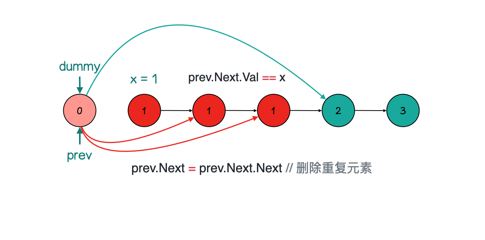

1. [✅ 56. 合并区间](#-56-合并区间)
2. [✅ 剑指 Offer 22. 链表中倒数第k个节点](#-剑指-offer-22-链表中倒数第k个节点)
3. [✅ 69. x 的平方根](#-69-x-的平方根)
4. [✅ 82. 删除排序链表中的重复元素 II](#-82-删除排序链表中的重复元素-ii)


## ✅ [56. 合并区间](https://leetcode-cn.com/problems/merge-intervals/)


## ✅ [剑指 Offer 22. 链表中倒数第k个节点](https://leetcode-cn.com/problems/lian-biao-zhong-dao-shu-di-kge-jie-dian-lcof/)

```go

```

```go

```


## ✅ [69. x 的平方根](https://leetcode-cn.com/problems/sqrtx/)

**方法一：二分查找**

```go

```
复杂度分析

- 时间复杂度：O(logx)，即为二分查找需要的次数。
- 空间复杂度：O(1)。


**方法二：牛顿迭代**

```go

```
复杂度分析

- 时间复杂度：O(logx)，此方法是二次收敛的，相较于二分查找更快。
- 空间复杂度：O(1)。


## ✅ [82. 删除排序链表中的重复元素 II](https://leetcode-cn.com/problems/remove-duplicates-from-sorted-list-ii/)





```go

```


