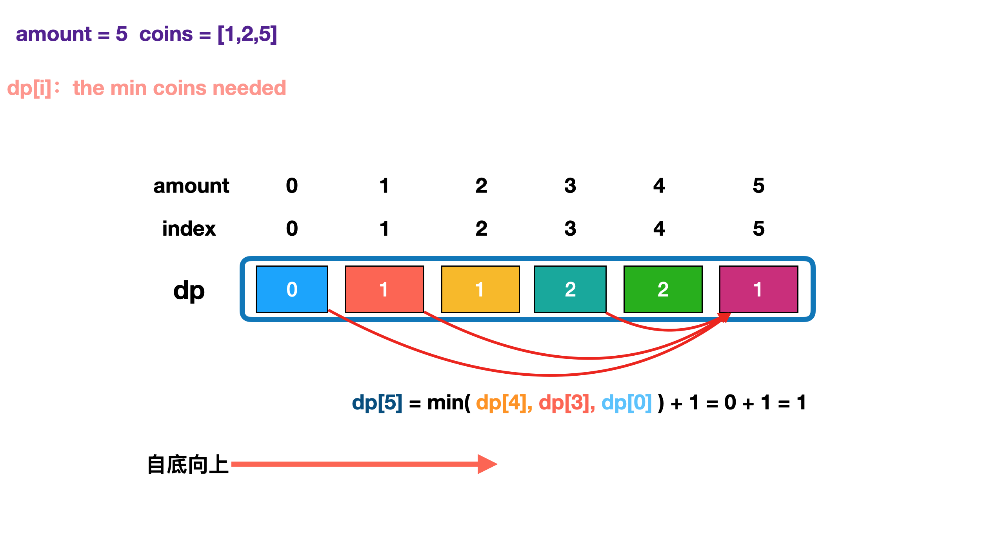

<!-- 
[93. 复原 IP 地址](https://leetcode-cn.com/problems/restore-ip-addresses/) 


[239. 滑动窗口最大值](https://leetcode-cn.com/problems/sliding-window-maximum/)


[144. 二叉树的前序遍历](https://leetcode-cn.com/problems/binary-tree-preorder-traversal/)

[151. 翻转字符串里的单词](https://leetcode-cn.com/problems/reverse-words-in-a-string/)


[105. 从前序与中序遍历序列构造二叉树](https://leetcode-cn.com/problems/construct-binary-tree-from-preorder-and-inorder-traversal/)


[76. 最小覆盖子串](https://leetcode-cn.com/problems/minimum-window-substring/) 


[110. 平衡二叉树](https://leetcode-cn.com/problems/balanced-binary-tree/)


[155. 最小栈](https://leetcode-cn.com/problems/min-stack/)

[322. 零钱兑换](https://leetcode-cn.com/problems/coin-change/)


[104. 二叉树的最大深度](https://leetcode-cn.com/problems/maximum-depth-of-binary-tree/) 
-->


[93. 复原 IP 地址](https://leetcode-cn.com/problems/restore-ip-addresses/) 

```go
func restoreIpAddresses(s string) []string {
	res := []string{}
	var dfs func([]string, int)

	dfs = func(sub []string, start int) {
		if len(sub) == 4 && start == len(s) { // 片段满4段，且耗尽所有字符
			res = append(res, strings.Join(sub, ".")) // 拼成字符串，加入解集
			return
		}
		if len(sub) == 4 && start < len(s) { // 满4段，字符未耗尽，不用往下选了
			return
		}
		for length := 1; length <= 3; length++ { // 枚举出选择，三种切割长度
			if start+length-1 >= len(s) { // 加上要切的长度就越界，不能切这个长度
				return
			}
			if length != 1 && s[start] == '0' { // 不能切出'0x'、'0xx'
				return
			}
			str := s[start : start+length]          // 当前选择切出的片段
			if n, _ := strconv.Atoi(str); n > 255 { // 不能超过255
				return
			}
			sub = append(sub, str) // 作出选择，将片段加入sub
			dfs(sub, start+length) // 基于当前选择，继续选择，注意更新指针
			sub = sub[:len(sub)-1] // 上面一句的递归分支结束，撤销最后的选择，进入下一轮迭代，考察下一个切割长度
		}
	}
	dfs([]string{}, 0)
	return res
}
```


[239. 滑动窗口最大值](https://leetcode-cn.com/problems/sliding-window-maximum/)

```go
func maxSlidingWindow(nums []int, k int) []int {
	q, res, n := []int{}, []int{}, len(nums)
	for i := 0; i < n; i++ {
		if len(q) > 0 && i-k+1 > q[0] { //窗口满了，删除队头
			q = q[1:]
		}
		for len(q) > 0 && nums[q[len(q)-1]] <= nums[i] { //队尾小于等于当前元素，删除队尾
			q = q[:len(q)-1]
		}
		q = append(q, i)
		if i-k+1 >= 0 { //窗口大于等于 k
			res = append(res, nums[q[0]])
		}
	}
	return res
}
```


[144. 二叉树的前序遍历](https://leetcode-cn.com/problems/binary-tree-preorder-traversal/)

```go
/**
 * Definition for a binary tree node.
 * type TreeNode struct {
 *     Val int
 *     Left *TreeNode
 *     Right *TreeNode
 * }
 */
func preorderTraversal(root *TreeNode) (res []int) {
	var preorder func(*TreeNode)
	preorder = func(node *TreeNode) { // 前序遍历：根左右
		if node == nil {
			return
		}  
		res = append(res, node.Val)
		preorder(node.Left)
		preorder(node.Right)
	}
	preorder(root)
	return
}
```

[151. 翻转字符串里的单词](https://leetcode-cn.com/problems/reverse-words-in-a-string/)


```go
func reverseWords(s string) string {
	sf := strings.Fields(s)      // sf = ["the", "sky", "is", "blue"]
	reverse(&sf, 0, len(sf)-1)   // ["blue", "is", "sky", "the"]
	return strings.Join(sf, " ") // "blue is sky the"
}
func reverse(m *[]string, i, j int) {
	for i <= j {
		(*m)[i], (*m)[j] = (*m)[j], (*m)[i]
		i++
		j--
	}
}
```

[105. 从前序与中序遍历序列构造二叉树](https://leetcode-cn.com/problems/construct-binary-tree-from-preorder-and-inorder-traversal/)

```go
/**
 * Definition for a binary tree node.
 * type TreeNode struct {
 *     Val int
 *     Left *TreeNode
 *     Right *TreeNode
 * }
 */
func buildTree(preorder []int, inorder []int) *TreeNode {
	if len(preorder) == 0 {
		return nil
	}
	root := &TreeNode{Val: preorder[0]}
	for pos, node_val := range inorder {
		if node_val == root.Val {
			root.Left = buildTree(preorder[1:pos+1], inorder[:pos+1])
			root.Right = buildTree(preorder[pos+1:], inorder[pos+1:])
		}
	}
	return root
}
```

[76. 最小覆盖子串](https://leetcode-cn.com/problems/minimum-window-substring/) 

```go

```


[110. 平衡二叉树](https://leetcode-cn.com/problems/balanced-binary-tree/)

```go
/**
 * Definition for a binary tree node.
 * type TreeNode struct {
 *     Val int
 *     Left *TreeNode
 *     Right *TreeNode
 * }
 */
func isBalanced(root *TreeNode) bool {
	if root == nil {
		return true
	}
	leftHeight, rightHeight := depth(root.Left), depth(root.Right)
	return abs(leftHeight-rightHeight) <= 1 && isBalanced(root.Left) && isBalanced(root.Right)
}
func depth(root *TreeNode) int {
	if root == nil {
		return 0
	}
	return 1 + max(depth(root.Left), depth(root.Right))
}
func abs(x int) int {
	if x < 0 {
		return -x
	}
	return x
}
func max(x, y int) int {
	if x > y {
		return x
	}
	return y
}
```

[155. 最小栈](https://leetcode-cn.com/problems/min-stack/)

```go
type MinStack struct {
	stack    []int
	minStack []int
}

func Constructor() MinStack {
	return MinStack{
		stack:    []int{},
		minStack: []int{math.MaxInt64},
	}
}

func (this *MinStack) Push(x int) {
	this.stack = append(this.stack, x)
	top := this.minStack[len(this.minStack)-1]
	this.minStack = append(this.minStack, min(x, top))
}

func (this *MinStack) Pop() {
	this.stack = this.stack[:len(this.stack)-1]
	this.minStack = this.minStack[:len(this.minStack)-1]
}

func (this *MinStack) Top() int {
	return this.stack[len(this.stack)-1]
}

func (this *MinStack) GetMin() int {
	return this.minStack[len(this.minStack)-1]
}

func min(x, y int) int {
	if x < y {
		return x
	}
	return y
}

/**
 * Your MinStack object will be instantiated and called as such:
 * obj := Constructor();
 * obj.Push(x);
 * obj.Pop();
 * param_3 := obj.Top();
 * param_4 := obj.GetMin();
 */
```

[322. 零钱兑换](https://leetcode-cn.com/problems/coin-change/)




```go

```

[518. 零钱兑换 II](https://leetcode-cn.com/problems/coin-change-2/) 补充


#### iterate coins

```go

```


[104. 二叉树的最大深度](https://leetcode-cn.com/problems/maximum-depth-of-binary-tree/) 

```go
/**
 * Definition for a binary tree node.
 * type TreeNode struct {
 *     Val int
 *     Left *TreeNode
 *     Right *TreeNode
 * }
 */
func maxDepth(root *TreeNode) int {
	if root == nil {
		return 0
	}
	return 1 + max(maxDepth(root.Left), maxDepth(root.Right))
}
func max(x, y int) int {
	if x > y {
		return x
	}
	return y
}
```


