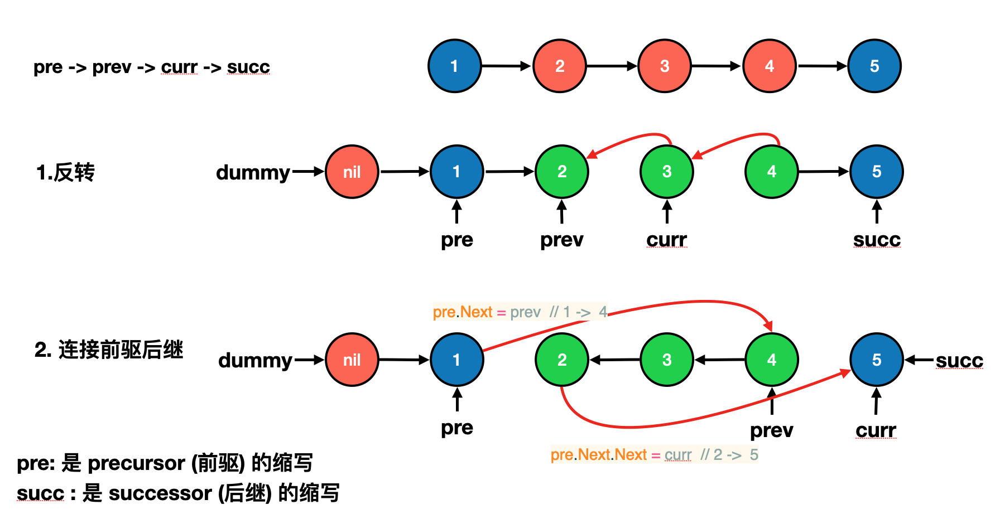
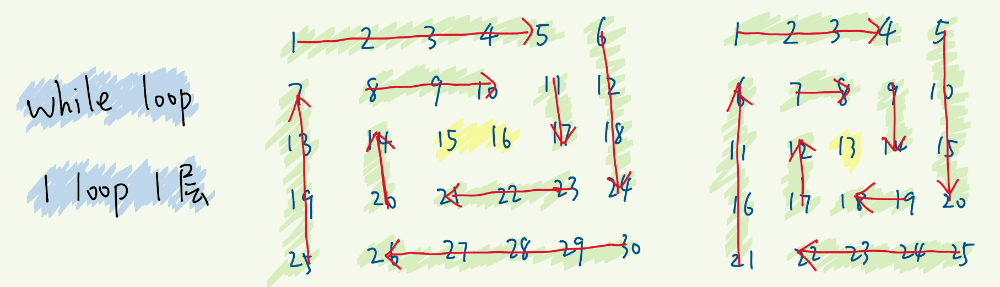
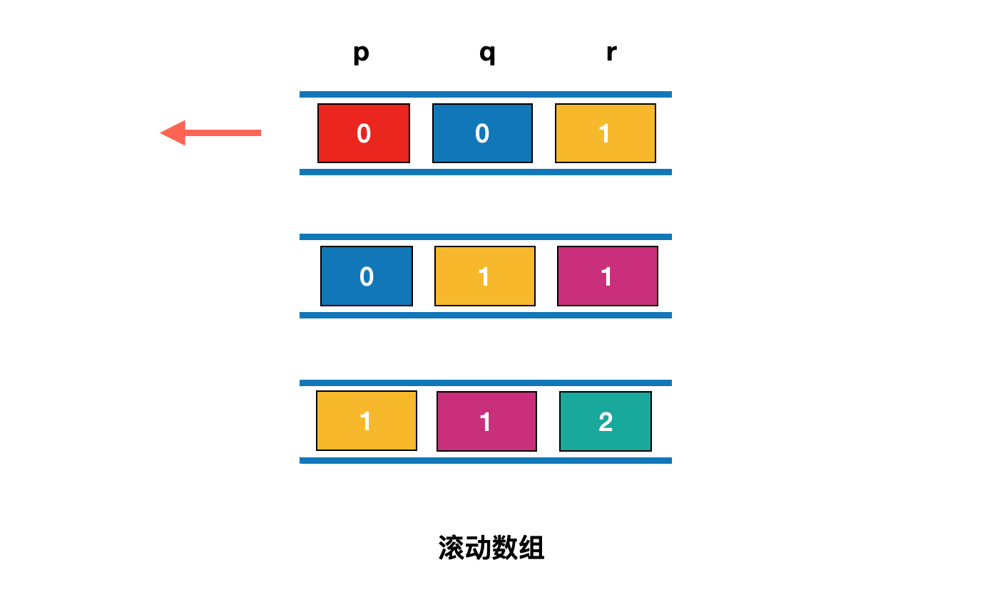
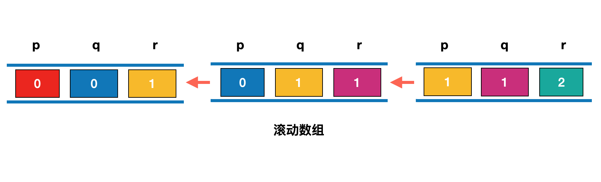
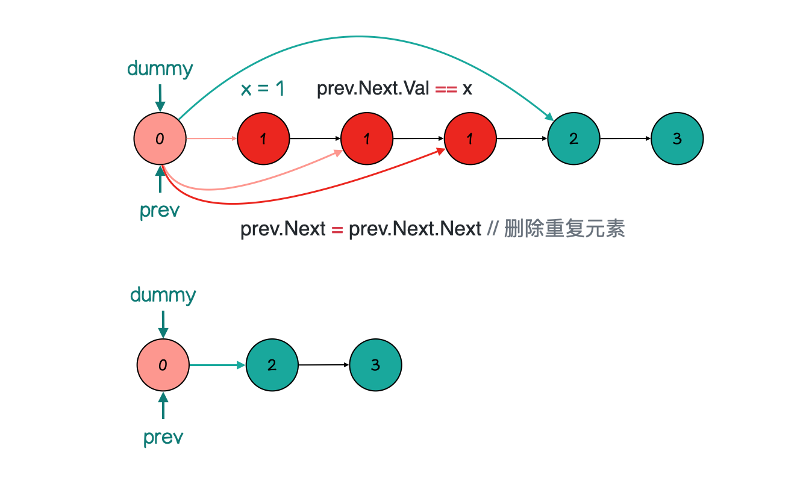

1. [✅ 33. 搜索旋转排序数组](#-33-搜索旋转排序数组)
2. [✅ 200. 岛屿数量](#-200-岛屿数量)
3. [✅ 46. 全排列](#-46-全排列)
4. [✅ 47. 全排列 II 补充](#-47-全排列-ii-补充)
5. [✅ 92. 反转链表 II](#-92-反转链表-ii)
6. [✅ 142. 环形链表 II](#-142-环形链表-ii)
7. [✅ 23. 合并K个升序链表](#-23-合并k个升序链表)
8. [✅ 54. 螺旋矩阵](#-54-螺旋矩阵)
9. [✅ 704. 二分查找](#-704-二分查找)
10. [✅ 300. 最长递增子序列](#-300-最长递增子序列)
11. [✅ 42. 接雨水](#-42-接雨水)
12. [✅ 232. 用栈实现队列](#-232-用栈实现队列)
13. [✅ 94. 二叉树的中序遍历](#-94-二叉树的中序遍历)
14. [✅ 199. 二叉树的右视图](#-199-二叉树的右视图)
15. [✅ 143. 重排链表](#-143-重排链表)
16. [✅ 70. 爬楼梯](#-70-爬楼梯)
17. [✅ 56. 合并区间](#-56-合并区间)
18. [✅ 124. 二叉树中的最大路径和](#-124-二叉树中的最大路径和)
19. [✅ 剑指 Offer 22. 链表中倒数第k个节点](#-剑指-offer-22-链表中倒数第k个节点)
20. [✅ 69. x 的平方根](#-69-x-的平方根)
21. [✅ 82. 删除排序链表中的重复元素 II](#-82-删除排序链表中的重复元素-ii)

<!--
[33. 搜索旋转排序数组](https://leetcode-cn.com/problems/search-in-rotated-sorted-array/)

[200. 岛屿数量](https://leetcode-cn.com/problems/number-of-islands/)

[46. 全排列](https://leetcode-cn.com/problems/permutations/)

[47. 全排列 II](https://leetcode-cn.com/problems/permutations-ii/)  补充

[92. 反转链表 II](https://leetcode-cn.com/problems/reverse-linked-list-ii/)

[142. 环形链表 II](https://leetcode-cn.com/problems/linked-list-cycle-ii/)

[23. 合并K个升序链表](https://leetcode-cn.com/problems/merge-k-sorted-lists/)

[54. 螺旋矩阵](https://leetcode-cn.com/problems/spiral-matrix/)

[704. 二分查找](https://leetcode-cn.com/problems/binary-search/)

[300. 最长递增子序列](https://leetcode-cn.com/problems/longest-increasing-subsequence/)

[42. 接雨水](https://leetcode-cn.com/problems/trapping-rain-water/)
-->

## ✅ [33. 搜索旋转排序数组](https://leetcode-cn.com/problems/search-in-rotated-sorted-array/)


```go
func search(nums []int, target int) int {
	if len(nums) == 0 {
		return -1
	}
	l, r := 0, len(nums)-1
	for l <= r {
		mid := l + (r-l)>>1 //防止加法导致整数溢出 (l+r)>>1
		if target == nums[mid] {
			return mid
		}
		if nums[l] <= nums[mid] { //左边有序
			if nums[l] <= target && target < nums[mid] { //在左边
				r = mid - 1 //舍弃右边
			} else {
				l = mid + 1
			}
		} else { //右边有序
			if nums[mid] < target && target <= nums[r] {
				l = mid + 1
			} else {
				r = mid - 1
			}
		}
	}
	return -1
}
```

[参考](https://leetcode-cn.com/problems/search-in-rotated-sorted-array/solution/sou-suo-xuan-zhuan-pai-xu-shu-zu-by-leetcode-solut/)

## ✅ [200. 岛屿数量](https://leetcode-cn.com/problems/number-of-islands/)

**思路一：深度优先遍历DFS**

- 目标是找到矩阵中 “岛屿的数量” ，上下左右相连的 1 都被认为是连续岛屿。
- dfs方法： 设目前指针指向一个岛屿中的某一点 (i, j)，寻找包括此点的岛屿边界。
  1.  从 (i, j) 向此点的上下左右 (i,j+1),(i,j-1),(i-1,j),(i+1,j) 做深度搜索。
  2.  终止条件：
      - (i, j) 越过矩阵边界;
      - grid[i][j] == 0，代表此分支已越过岛屿边界。
  3.  搜索岛屿的同时，执行 grid[i][j] = '0'，即将岛屿所有节点删除，以免之后重复搜索相同岛屿。

**主循环：**

遍历整个矩阵，当遇到 grid[i][j] == '1' 时，从此点开始做深度优先搜索 dfs，岛屿数 count + 1 且在深度优先搜索中删除此岛屿。

- 最终返回岛屿数 count 即可。

```go
func numIslands(grid [][]byte) int {
	count := 0
	for i := 0; i < len(grid); i++ { //行
		for j := 0; j < len(grid[0]); j++ { //列
			if grid[i][j] == '1' {
				count++         //岛屿数量加1
				dfs(grid, i, j) //使用dfs将此岛屿所有元素变为'0',避免重复搜索
			}
		}
	}
	return count
}
func dfs(grid [][]byte, i, j int) {
	if 0 <= i && i < len(grid) && 0 <= j && j < len(grid[0]) && grid[i][j] == '1' {
		grid[i][j] = '0'  //已遍历
		dfs(grid, i+1, j) //右
		dfs(grid, i-1, j) //左
		dfs(grid, i, j+1) //上
		dfs(grid, i, j-1) //下
	}
}
```

**闭包**

```go
func numIslands(grid [][]byte) int {
	var dfs func(grid [][]byte, i, j int)
	dfs = func(grid [][]byte, i, j int) {
		if (i < 0 || j < 0) || i >= len(grid) || j >= len(grid[0]) || grid[i][j] == '0' {
			return
		}
		grid[i][j] = '0'
		dfs(grid, i+1, j)
		dfs(grid, i-1, j)
		dfs(grid, i, j-1)
		dfs(grid, i, j+1)
	}
	count := 0
	for i := 0; i < len(grid); i++ {
		for j := 0; j < len(grid[0]); j++ {
			if grid[i][j] == '1' {
				dfs(grid, i, j)
				count++
			}
		}
	}
	return count
}
```

## ✅ [46. 全排列](https://leetcode-cn.com/problems/permutations/)

**方法一：枚举每个位置，放每个数 (回溯)**


我们从前往后，一位一位枚举，每次选择一个没有被使用过的数。
选好之后，将该数的状态改成“已被使用”，同时将该数记录在相应位置上，然后递归。
递归返回时，不要忘记将该数的状态改成“未被使用”，并将该数从相应位置上删除。

**闭包**：

```go
func permute(nums []int) [][]int {
	used, path, res, n := make(map[int]bool, len(nums)), []int{}, [][]int{}, len(nums)
	var dfs func(int)
	dfs = func(pos int) { // 枚举位置
		if len(path) == n {
			res = append(res, append([]int{}, path...))
			return
		}
		for i := 0; i < n; i++ { // 枚举所有的选择
			if !used[i] { // 第i个位置未使用
				used[i] = true               // 第i个位置已使用
				path = append(path, nums[i]) // 做出选择，记录路径
				dfs(pos + 1)                 // 枚举下一个位置
				used[i] = false              // 撤销选择
				path = path[:len(path)-1]    // 取消记录
			}
		}
	}
	dfs(0)
	return res
}
```

**写法二：枚举每个位置，放每个数 (回溯)**

这个问题可以看作有 n 个排列成一行的空格，我们需要从左往右依此填入题目给定的 n 个数，每个数只能使用一次。那么很直接的可以想到一种穷举的算法，即从左往右每一个位置都依此尝试填入一个数，看能不能填完这 n 个空格，在程序中我们可以用「回溯法」来模拟这个过程。

假设我们已经填到第 pos 个位置


```go
func permute(nums []int) [][]int {
	res, n := [][]int{}, len(nums)
	var dfs func(int)
	dfs = func(pos int) { // 枚举位置
		if pos == n { // 所有数都填完了
			res = append(res, append([]int{}, nums...))
			return
		}
		for i := pos; i < n; i++ {
			nums[i], nums[pos] = nums[pos], nums[i] // 枚举所有的选择
			dfs(pos + 1)                            // 枚举下一个位置
			nums[i], nums[pos] = nums[pos], nums[i] // 撤销操作
		}
	}
	dfs(0)
	return res
}
```

复杂度分析

- 时间复杂度：O(n×n!)，其中 n 为序列的长度。
- 空间复杂度：O(n)，其中 n 为序列的长度。除答案数组以外，递归函数在递归过程中需要为每一层递归函数分配栈空间，所以这里需要额外的空间且该空间取决于递归的深度，这里可知递归调用深度为 O(n)。

[参考](https://leetcode-cn.com/problems/permutations/solution/quan-pai-lie-by-leetcode-solution-2/)

**为什么加入解集时，要将数组（在go中是切片）内容拷贝到一个新的数组里，再加入解集。**

```go
		if len(path) == n { // 个数选够了
			// res = append(res, append([]int{}, path...)) // path append后会扩容，消除前面的无效数据
			temp := make([]int, len(path))
			copy(temp, path)
			res = append(res, temp)
			return // 结束当前递归分支
		}
```

这个 path 变量是一个地址引用，结束当前递归，将它加入 res，后续的递归分支还要继续进行搜索，还要继续传递这个 path，这个地址引用所指向的内存空间还要继续被操作，所以 res 中的 path 所引用的内容会被改变，这就不对，所以要拷贝一份内容，到一份新的数组里，然后放入 res，这样后续对 path 的操作，就不会影响已经放入 res 的内容。

## ✅ [47. 全排列 II](https://leetcode-cn.com/problems/permutations-ii/) 补充

**方法一：枚举每个位置，放每个数 (回溯)**


我们将这个问题看作有 n 个排列成一行的空格，我们需要从左往右依次填入题目给定的 n 个数，每个数只能使用一次。那么很直接的可以想到一种穷举的算法，即从左往右每一个位置都依此尝试填入一个数，看能不能填完这 n 个空格，在程序中我们可以用「回溯法」来模拟这个过程。

假设我们有 3 个重复数排完序后相邻，那么我们一定保证每次都是拿从左往右第一个未被填过的数字，即整个数组的状态其实是保证了
[未填入，未填入，未填入] 到 [填入，未填入，未填入]，再到 [填入，填入，未填入]，最后到 [填入，填入，填入] 的过程的，因此可以达到去重的目标。

**dfs 闭包**

```go
func permuteUnique(nums []int) [][]int {
	sort.Ints(nums)
	used, path, res, n := make(map[int]bool, len(nums)), []int{}, [][]int{}, len(nums)
	var dfs func(int)
	dfs = func(pos int) { // 枚举位置
		if len(path) == n {
			res = append(res, append([]int{}, path...))
			return
		}
		for i := 0; i < n; i++ { // 枚举出所有的选择
			if used[i] || i > 0 && !used[i-1] && nums[i-1] == nums[i] { // 已使用 或 重复
				continue // 跳过
			}
			used[i] = true               // 记录路径上做过的选择
			path = append(path, nums[i]) // 做出选择，记录路径
			dfs(pos + 1)                 // 枚举下一个位置
			used[i] = false              // 撤销选择
			path = path[:len(path)-1]    // 取消记录
		}
	}
	dfs(0)
	return res
}
```

## ✅ [92. 反转链表 II](https://leetcode-cn.com/problems/reverse-linked-list-ii/)

- pre: 是 precursor (前驱) 的缩写
- succ : 是 successor (后继) 的缩写
- pre -> prev -> curr -> succ



**方法一：双指针**

```go
/**
 * Definition for singly-linked list.
 * type ListNode struct {
 *     Val int
 *     Next *ListNode
 * }
 */
func reverseBetween(head *ListNode, left int, right int) *ListNode {
	dummy := &ListNode{Next: head}
	pre := dummy // pre -> prev -> curr
	for i := 0; i < left-1; i++ {
		pre = pre.Next
	}
	prev, curr := pre.Next, pre.Next.Next
	for i := 0; i < right-left; i++ {
		next := curr.Next
		curr.Next = prev
		prev = curr
		curr = next
	}
	pre.Next.Next = curr // 2 -> 5
	pre.Next = prev      // 1 -> 4
	return dummy.Next
}
```

**方法二：头插法**

```go
/**
 * Definition for singly-linked list.
 * type ListNode struct {
 *     Val int
 *     Next *ListNode
 * }
 */
func reverseBetween(head *ListNode, left int, right int) *ListNode {
	dummy := &ListNode{Next: head}
	pre := dummy // pre -> curr -> next		1 -> 2 -> 3
	for i := 0; i < left-1; i++ {
		pre = pre.Next
	}
	curr := pre.Next
	for i := 0; i < right-left; i++ {
		next := curr.Next
		curr.Next = next.Next // 2 -> 4
		next.Next = pre.Next  // 3 -> 2
		pre.Next = next       // 1 -> 3
	}
	return dummy.Next
}
```

[参考](https://leetcode-cn.com/problems/reverse-linked-list-ii/solution/fan-zhuan-lian-biao-ii-by-leetcode-solut-teyq/)

## ✅ [142. 环形链表 II](https://leetcode-cn.com/problems/linked-list-cycle-ii/)

**方法一：快慢指针**

我们使用两个指针，fast 与 slow。它们起始都位于链表的头部。随后，

- slow 指针每次向后移动一个位置，而 fast 指针向后移动两个位置。
- 如果链表中存在环，则 fast 指针最终将再次与 slow 指针在环中相遇。
- 当发现 slow 与 fast 相遇时，我们再额外使用一个指针 ptr。起始，它指向链表头部；随后，它和 slow 每次向后移动一个位置。最终，它们会在入环点相遇。

```go
/**
 * Definition for singly-linked list.
 * type ListNode struct {
 *     Val int
 *     Next *ListNode
 * }
 */
func detectCycle(head *ListNode) *ListNode {
	slow, fast := head, head
	for fast != nil {
		slow = slow.Next
		if fast.Next == nil {
			return nil
		}
		fast = fast.Next.Next
		if slow == fast { // 第一次相遇
			p := head
			for p != slow {
				p = p.Next
				slow = slow.Next
			}
			return p // 第二次相遇
		}
	}
	return nil
}
```

[参考](https://leetcode-cn.com/problems/linked-list-cycle-ii/solution/huan-xing-lian-biao-ii-by-leetcode-solution/)

## ✅ [23. 合并K个升序链表](https://leetcode-cn.com/problems/merge-k-sorted-lists/)

**方法一：分治合并**

```go
/**
 * Definition for singly-linked list.
 * type ListNode struct {
 *     Val int
 *     Next *ListNode
 * }
 */
func mergeKLists(lists []*ListNode) *ListNode {
	n := len(lists)
	if n < 1 {
		return nil
	}
	if n == 1 {
		return lists[0]
	}
	mid := n >> 1
	left, right := mergeKLists(lists[:mid]), mergeKLists(lists[mid:])
	return mergeTwoLists(left, right)
}
func mergeTwoLists(l1, l2 *ListNode) *ListNode {
	if l1 == nil {
		return l2
	}
	if l2 == nil {
		return l1
	}
	if l1.Val < l2.Val {
		l1.Next = mergeTwoLists(l1.Next, l2)
		return l1
	} else {
		l2.Next = mergeTwoLists(l1, l2.Next)
		return l2
	}
}
```

[参考](https://leetcode-cn.com/problems/merge-k-sorted-lists/solution/he-bing-kge-pai-xu-lian-biao-by-leetcode-solutio-2/)

## ✅ [54. 螺旋矩阵](https://leetcode-cn.com/problems/spiral-matrix/)



- 如果一条边从头遍历到底，则下一条边遍历的起点随之变化

- 选择不遍历到底，可以减小横向、竖向遍历之间的影响

- 一轮迭代结束时，4条边的两端同时收窄 1

- 一轮迭代所做的事情很清晰：遍历一个“圈”，遍历的范围收缩为内圈

- 一层层向里处理，按顺时针依次遍历：上、右、下、左。

- 不再形成“环”了，就会剩下一行或一列，然后单独判断

**四个边界**

- 上边界 top : 0
- 下边界 bottom : matrix.length - 1
- 左边界 left : 0
- 右边界 right : matrix[0].length - 1

**矩阵不一定是方阵**

- top < bottom && left < right 是循环的条件
- 无法构成“环”了，就退出循环，退出时可能是这 3 种情况之一：
- top == bottom && left < right —— 剩一行
- top < bottom && left == right —— 剩一列
- top == bottom && left == right —— 剩一项（也是一行/列）

**处理剩下的单行或单列**

- 因为是按顺时针推入结果数组的，所以
- 剩下的一行，从左至右 依次推入结果数组
- 剩下的一列，从上至下 依次推入结果数组

**代码**

每个元素访问一次，

**复杂度**

- 时间复杂度 O(m\*n)，m、n 分别是矩阵的行数和列数
- 空间复杂度 O(m\*n)

```go
func spiralOrder(matrix [][]int) []int {
	if len(matrix) == 0 {
		return []int{}
	}
	res := []int{}
	top, right, bottom, left := 0, len(matrix[0])-1, len(matrix)-1, 0
	for top < bottom && left < right {	// 一条边不从头遍历到底 (不包括最后一个元素)
		for i := left; i < right; i ++ { res = append(res, matrix[top][i])}    // 上层  (top 行 i 列)
		for i := top; i < bottom; i ++ { res = append(res, matrix[i][right])}  // 右层  (i 行 right 列)
		for i := right; i > left; i -- { res = append(res, matrix[bottom][i])} // 下层  (bottom 行 i 列)
		for i := bottom; i > top; i -- { res = append(res, matrix[i][left])}   // 左层  (i 行 left 列)
		top ++		// 四个边界同时收缩，进入内层
		right --
		bottom --
		left ++
	}
	if top == bottom {
		for i := left; i <= right; i ++ { res = append(res, matrix[top][i])}  // 只剩一行，从左到右依次添加
	} else if left == right {
		for i := top; i <= bottom; i ++ { res = append(res, matrix[i][left])} // 只剩一列，从上到下依次添加
	}
	return res
}
```

**换一种遍历的策略：遍历到底**


- 循环的条件改为： top <= bottom && left <= right
- 每遍历一条边，下一条边遍历的起点被“挤占”，要更新相应的边界
- 值得注意的是，可能出现 在循环中途，不再满足循环的条件 ，即出现 top > bottom || left > right ，其中一对边界彼此交错了
- 这意味着此时所有项都遍历完了，如果没有及时 break ，就会重复遍历

**解决办法**

- 每遍历完一条边，更新完相应的边界后，都加一条判断 if (top > bottom || left > right) break，避免遍历完成时没有及时退出，导致重复遍历。
- 但你发现，**遍历完成要么发生在遍历完“上边”，要么发生在遍历完“右边”**
- 所以只需在这两步操作之后，加 if (top > bottom || left > right) break 即可

```go
func spiralOrder(matrix [][]int) []int {
	if len(matrix) == 0 {
		return []int{}
	}
	res := []int{}
	top, right, bottom, left := 0, len(matrix[0])-1, len(matrix)-1, 0
	for top <= bottom && left <= right {	// 一条边从头遍历到底 (包括最后一个元素)
		for i := left; i <= right; i ++ { res = append(res, matrix[top][i])}    // 上层  top 行 i 列
		top ++
		for i := top; i <= bottom; i ++ { res = append(res, matrix[i][right])}  // 右层  i 行 right 列
		right --
		if top > bottom || left > right { break }
		for i := right; i >= left; i -- { res = append(res, matrix[bottom][i])} // 下层  bottom 行 i 列
		bottom --
		for i := bottom; i >= top; i -- { res = append(res, matrix[i][left])}   // 左层  i 行 left 列
		left ++		// 四个边界同时收缩，进入内层
	}
	return res
}
```

**换一种循环的条件，也是可以的**

- 遍历完所有项时，res 数组构建完毕。我们可以用 res 数组的长度 等于 矩阵的项的个数，作为循环的结束条件
- 不等于就继续遍历，等于就 break

```go
func spiralOrder(matrix [][]int) []int {
	if len(matrix) == 0 {
		return []int{}
	}
	res := []int{}
	top, right, bottom, left := 0, len(matrix[0])-1, len(matrix)-1, 0
	size := len(matrix) * len(matrix[0])
	for len(res) != size {			  // 仍未遍历结束
		for i := left; i <= right; i ++ { res = append(res, matrix[top][i])}    // 上层  top 行 i 列
		top ++
		for i := top; i <= bottom; i ++ { res = append(res, matrix[i][right])}  // 右层  i 行 right 列
		right --
		if len(res) == size { break } // 遍历结束
		for i := right; i >= left; i -- { res = append(res, matrix[bottom][i])} // 下层  bottom 行 i 列
		bottom --
		for i := bottom; i >= top; i -- { res = append(res, matrix[i][left])}   // 左层  i 行 left 列
		left ++		 				  // 四个边界同时收缩，进入内层
	}
	return res
}
```

[参考](https://leetcode-cn.com/problems/spiral-matrix/solution/shou-hui-tu-jie-liang-chong-bian-li-de-ce-lue-kan-/)

## ✅ [704. 二分查找](https://leetcode-cn.com/problems/binary-search/)

1. 如果目标值等于中间元素，则找到目标值。
2. 如果目标值较小，继续在左侧搜索。
3. 如果目标值较大，则继续在右侧搜索。

**算法：**

- 初始化指针 left = 0, right = n - 1。
- 当 left <= right： // 等于：考察一个数
  比较中间元素 nums[mid] 和目标值 target 。1. 如果 target = nums[mid]，返回 mid。2. 如果 target < nums[mid]，则在左侧继续搜索 right = mid - 1。3. 如果 target > nums[mid]，则在右侧继续搜索 left = mid + 1。

```go
func search(nums []int, target int) int {
	left, right := 0, len(nums)-1
	for left <= right {
		mid := left + (right-left)>>1
		if nums[mid] == target {
			return mid
		} else if nums[mid] < target {
			left = mid + 1
		} else {
			right = mid - 1
		}
	}
	return -1
}
```

复杂度分析

- 时间复杂度：O(logN)。
- 空间复杂度：O(1)。

## ✅ [300. 最长递增子序列](https://leetcode-cn.com/problems/longest-increasing-subsequence/)

**方法一： nlogn 动态规划**

```go
func lengthOfLIS(nums []int) int {
	dp := []int{} // 维护单调递增数组 sorted
	for _, x := range nums {
		// 在递增顺序的数组dp中搜索x，返回x的索引。如果查找不到，返回值是x应该插入dp的位置
		i := sort.SearchInts(dp, x) // min_index
		if i == len(dp) {           // dp 中不存在 x
			dp = append(dp, x)
		} else {
			dp[i] = x // dp 中存在 x，更新
		}
	}
	return len(dp)
}
```

复杂度分析

- 时间复杂度：O(nlogn)。数组 nums 的长度为 n，我们依次用数组中的元素去更新 dp 数组，而更新 dp 数组时需要进行 O(logn) 的二分搜索，所以总时间复杂度为 O(nlogn)。

- 空间复杂度：O(n)，需要额外使用长度为 n 的 dp 数组。

**func SearchInts**

- func SearchInts(a []int, x int) int
- SearchInts在递增顺序的a中搜索x，返回x的索引。如果查找不到，返回值是x应该插入a的位置（以保证a的递增顺序），返回值可以是len(a)。

**方法二：贪心 + 二分查找**

```go
func lengthOfLIS(nums []int) int {
	d := []int{} // 维护单调递增数组
	for _, n := range nums {
		if len(d) == 0 || d[len(d)-1] < n {
			d = append(d, n)
		} else {
			l, r, pos := 0, len(d)-1, 0
			for l <= r {
				mid := l + (r-l)>>1
				if d[mid] >= n { // 二分查找 第一个大于 n 的数
					pos = mid
					r = mid - 1
				} else {
					l = mid + 1
				}
			}
			d[pos] = n
		}
	}
	return len(d)
}
```

复杂度分析

- 时间复杂度：O(nlogn)。数组 nums 的长度为 n，我们依次用数组中的元素去更新 d 数组，而更新 d 数组时需要进行 O(logn) 的二分搜索，所以总时间复杂度为 O(nlogn)。

- 空间复杂度：O(n)，需要额外使用长度为 n 的 d 数组。

**方法三：动态规划**

```go
func lengthOfLIS(nums []int) int {
	n := len(nums)
	if n == 0 {
		return 0
	}
	dp, to_ret := make([]int, n), 0
	for i := 0; i < n; i++ {
		dp[i] = 1
		for j := 0; j < i; j++ {
			if nums[j] < nums[i] {
				dp[i] = max(dp[i], dp[j]+1) // 前 i 个数字结尾的最长上升子序列的长度
			}
		}
		to_ret = max(to_ret, dp[i])
	}
	return to_ret
}
func max(x, y int) int {
	if x > y {
		return x
	}
	return y
}
```

复杂度分析：

- 时间复杂度 O(N^2)： 遍历计算 dp 列表需 O(N)，计算每个 dp[i] 需 O(N)。
- 空间复杂度 O(N) ： dp 列表占用线性大小额外空间。

[参考](https://leetcode-cn.com/problems/longest-increasing-subsequence/solution/zui-chang-shang-sheng-zi-xu-lie-by-leetcode-soluti/)

## ✅ [42. 接雨水](https://leetcode-cn.com/problems/trapping-rain-water/)

**方法一：双指针**


```go
func trap(height []int) (res int) {
	left, right := 0, len(height)-1
	leftMax, rightMax := 0, 0
	for left < right {
		leftMax = max(leftMax, height[left])
		rightMax = max(rightMax, height[right])
		if height[left] < height[right] {
			res += leftMax - height[left]
			left++
		} else {
			res += rightMax - height[right]
			right--
		}
	}
	return
}
func max(x, y int) int {
	if x > y {
		return x
	}
	return y
}
```

[参考](https://leetcode-cn.com/problems/trapping-rain-water/solution/jie-yu-shui-by-leetcode-solution-tuvc/)

**方法二：单调栈**

```go
func trap(height []int) (res int) {
	stack := []int{}
	for i, h := range height {
		for len(stack) > 0 && h > height[stack[len(stack)-1]] {
			top := stack[len(stack)-1]
			stack = stack[:len(stack)-1]
			if len(stack) == 0 {
				break
			}
			left := stack[len(stack)-1]
			curWidth := i - left - 1
			curHeight := min(height[left], h) - height[top]
			res += curWidth * curHeight
		}
		stack = append(stack, i)
	}
	return
}
func min(x, y int) int {
	if x < y {
		return x
	}
	return y
}
```

- 单调栈：查找每个数左侧第一个比它小的数
- 单调队列：滑动窗口中的最值

---

<!--

[232. 用栈实现队列](https://leetcode-cn.com/problems/implement-queue-using-stacks/)

[94. 二叉树的中序遍历](https://leetcode-cn.com/problems/binary-tree-inorder-traversal/)

[199. 二叉树的右视图](https://leetcode-cn.com/problems/binary-tree-right-side-view/)

[143. 重排链表](https://leetcode-cn.com/problems/reorder-list/)

[70. 爬楼梯](https://leetcode-cn.com/problems/climbing-stairs/)


[剑指 Offer 22. 链表中倒数第k个节点](https://leetcode-cn.com/problems/lian-biao-zhong-dao-shu-di-kge-jie-dian-lcof/)

[124. 二叉树中的最大路径和](https://leetcode-cn.com/problems/binary-tree-maximum-path-sum/)

[56. 合并区间](https://leetcode-cn.com/problems/merge-intervals/)

[69. x 的平方根](https://leetcode-cn.com/problems/sqrtx/)

[82. 删除排序链表中的重复元素 II](https://leetcode-cn.com/problems/remove-duplicates-from-sorted-list-ii/)


-->

## ✅ [232. 用栈实现队列](https://leetcode-cn.com/problems/implement-queue-using-stacks/)

**方法一：双栈**

**思路**

- 将一个栈当作输入栈，用于压入 push 传入的数据；
- 另一个栈当作输出栈，用于 pop 和 peek 操作。

每次 pop 或 peek 时，若输出栈为空则将输入栈的全部数据依次弹出并压入输出栈，这样输出栈从栈顶往栈底的顺序就是队列从队首往队尾的顺序。


```go
type MyQueue struct {
	inStack, outStack []int
}

/** Initialize your data structure here. */
func Constructor() MyQueue {
	return MyQueue{}
}

/** Push element x to the back of queue. */
func (q *MyQueue) Push(x int) {
	q.inStack = append(q.inStack, x)
}

func (q *MyQueue) in2out() {
	for len(q.inStack) > 0 {
		q.outStack = append(q.outStack, q.inStack[len(q.inStack)-1])
		q.inStack = q.inStack[:len(q.inStack)-1]
	}
}

/** Removes the element from in front of queue and returns that element. */
func (q *MyQueue) Pop() int {
	if len(q.outStack) == 0 {
		q.in2out()
	}
	x := q.outStack[len(q.outStack)-1]
	q.outStack = q.outStack[:len(q.outStack)-1]
	return x
}

/** Get the front element. */
func (q *MyQueue) Peek() int {
	if len(q.outStack) == 0 {
		q.in2out()
	}
	return q.outStack[len(q.outStack)-1]
}

/** Returns whether the queue is empty. */
func (q *MyQueue) Empty() bool {
	return len(q.inStack) == 0 && len(q.outStack) == 0
}
```

复杂度分析

- 时间复杂度：push 和 empty 为 O(1)，pop 和 peek 为均摊 O(1)。对于每个元素，至多入栈和出栈各两次，故均摊复杂度为 O(1)。

- 空间复杂度：O(n)。其中 n 是操作总数。对于有 n 次 push 操作的情况，队列中会有 n 个元素，故空间复杂度为 O(n)。

## ✅ [94. 二叉树的中序遍历](https://leetcode-cn.com/problems/binary-tree-inorder-traversal/)

```go
/**
 * Definition for a binary tree node.
 * type TreeNode struct {
 *     Val int
 *     Left *TreeNode
 *     Right *TreeNode
 * }
 */
func inorderTraversal(root *TreeNode) (res []int) {
	var inorder func(node *TreeNode)
	inorder = func(node *TreeNode) {
		if node == nil {
			return
		}
		inorder(node.Left)
		res = append(res, node.Val)
		inorder(node.Right)
	}
	inorder(root)
	return
}
```

```go
func inorderTraversal(root *TreeNode) (res []int) {
	stack := []*TreeNode{}
	for root != nil || len(stack) > 0 {
		for root != nil {
			stack = append(stack, root)
			root = root.Left
		}
		root = stack[len(stack)-1]   //取栈顶
		stack = stack[:len(stack)-1] //出栈
		res = append(res, root.Val)
		root = root.Right
	}
	return
}
```

[参考](https://leetcode-cn.com/problems/binary-tree-inorder-traversal/solution/er-cha-shu-de-zhong-xu-bian-li-by-leetcode-solutio/)

## ✅ [199. 二叉树的右视图](https://leetcode-cn.com/problems/binary-tree-right-side-view/)

**方法一：DFS**

思路： 我们按照 「根结点 -> 右子树 -> 左子树」 的顺序访问，就可以保证每层都是最先访问最右边的节点的。

（与先序遍历 「根结点 -> 左子树 -> 右子树」 正好相反，先序遍历每层最先访问的是最左边的节点）

我们对树进行深度优先搜索，在搜索过程中，我们总是先访问右子树。那么对于每一层来说，我们在这层见到的第一个结点一定是最右边的结点。

- 从根节点开始访问，根节点深度是0
- 先访问 当前节点，再递归地访问 右子树 和 左子树。
- 如果当前节点所在深度还没有出现在res里，说明在该深度下当前节点是第一个被访问的节点，因此将当前节点加入res中。

```go
 * Definition for a binary tree node.
 * type TreeNode struct {
 *     Val int
 *     Left *TreeNode
 *     Right *TreeNode
 * }
 */
func rightSideView(root *TreeNode) (res []int) {
	var dfs func(*TreeNode, int)
	dfs = func(node *TreeNode, depth int) {
		if node == nil {
			return
		}
		if depth == len(res) { // 如果不存在对应深度的节点
			res = append(res, node.Val) // 插入
		}
		dfs(node.Right, depth+1)
		dfs(node.Left, depth+1)
	}
	dfs(root, 0)
	return
}
```

**复杂度分析**

- 时间复杂度： O(N)，每个节点都访问了 1 次。

- 空间复杂度： O(N)，因为这不是一棵平衡二叉树，二叉树的深度最少是 logN, 最坏的情况下会退化成一条链表，深度就是 N，因此递归时使用的栈空间是 O(N) 的。

**方法二：BFS**

思路： 利用 BFS 进行层次遍历，记录下每层的最后一个元素。

```go
func rightSideView(root *TreeNode) []int {
	res := []int{}
	if root == nil {
		return res
	}
	queue := []*TreeNode{root}
	for len(queue) != 0 {
		size := len(queue)
		for i := 0; i < size; i++ {
			node := queue[0]
			queue = queue[1:]
			if node.Left != nil {
				queue = append(queue, node.Left)
			}
			if node.Right != nil {
				queue = append(queue, node.Right)
			}
			if i == size-1 {
				res = append(res, node.Val)
			}
		}
	}
	return res
}
```

**复杂度分析**

- 时间复杂度： O(N)，每个节点都入队出队了 1 次。

- 空间复杂度： O(N)，使用了额外的队列空间。

## ✅ [143. 重排链表](https://leetcode-cn.com/problems/reorder-list/)

```go
/**
 * Definition for singly-linked list.
 * type ListNode struct {
 *     Val int
 *     Next *ListNode
 * }
 */
func reorderList(head *ListNode) {
	if head == nil {
		return
	}
	mid := middleNode(head)
	l1, l2 := head, mid.Next
	mid.Next = nil
	l2 = reverse(l2)
	mergeList(l1, l2)
}

func middleNode(head *ListNode) *ListNode {
	slow, fast := head, head
	for fast.Next != nil && fast.Next.Next != nil {
		slow = slow.Next
		fast = fast.Next.Next
	}
	return slow
}

func reverse(head *ListNode) *ListNode {
	var prev *ListNode
	curr := head
	for curr != nil {
		next := curr.Next
		curr.Next = prev
		prev = curr
		curr = next
	}
	return prev
}

func mergeList(l1, l2 *ListNode) {
	var l1Tmp, l2Tmp *ListNode
	for l1 != nil && l2 != nil {
		l1Tmp, l2Tmp = l1.Next, l2.Next
		l1.Next = l2
		l1 = l1Tmp
		l2.Next = l1
		l2 = l2Tmp
	}
}
```

```go
func reorderList(head *ListNode) {
	if head == nil || head.Next == nil {
		return
	}

	// 寻找中间结点
	p1 := head
	p2 := head
	for p2.Next != nil && p2.Next.Next != nil {
		p1 = p1.Next
		p2 = p2.Next.Next
	}
	// 反转链表后半部分  1->2->3->4->5->6 to 1->2->3->6->5->4
	preMiddle := p1
	curr := p1.Next
	for curr.Next != nil {
		next := curr.Next
		curr.Next = next.Next
		next.Next = preMiddle.Next
		preMiddle.Next = next
	}

	// 重新拼接链表  1->2->3->6->5->4 to 1->6->2->5->3->4
	p1 = head
	p2 = preMiddle.Next
	for p1 != preMiddle {
		preMiddle.Next = p2.Next
		p2.Next = p1.Next
		p1.Next = p2
		p1 = p2.Next
		p2 = preMiddle.Next
	}
}
```

## ✅ [70. 爬楼梯](https://leetcode-cn.com/problems/climbing-stairs/)

**方法一：滚动数组 (斐波那契数列)**




思路和算法

我们用 f(x) 表示爬到第 x 级台阶的方案数，考虑最后一步可能跨了一级台阶，也可能跨了两级台阶，所以我们可以列出如下式子：

f(x) = f(x - 1) + f(x - 2)

f(x) 只和 f(x−1) 与 f(x−2) 有关，所以我们可以用「滚动数组思想」把空间复杂度优化成 O(1)。

```go
func climbStairs(n int) int {
	p, q, r := 0, 0, 1
	for i := 1; i <= n; i++ {
		p = q
		q = r
		r = p + q
	}
	return r
}
```

复杂度分析

- 时间复杂度：循环执行 n 次，每次花费常数的时间代价，故渐进时间复杂度为 O(n)。
- 空间复杂度：这里只用了常数个变量作为辅助空间，故渐进空间复杂度为 O(1)。

[参考](https://leetcode-cn.com/problems/climbing-stairs/solution/pa-lou-ti-by-leetcode-solution/)

**方法二：动态规划**

解题思路

- 简单的 DP，经典的爬楼梯问题。一个楼梯可以由 n-1 和 n-2 的楼梯爬上来。
- 这一题求解的值就是斐波那契数列。

```go
func climbStairs(n int) int {
	dp := make([]int, n+1)
	dp[0], dp[1] = 1, 1
	for i := 2; i <= n; i++ {
		dp[i] = dp[i-1] + dp[i-2]
	}
	return dp[n]
}
```

复杂度分析

- 时间复杂度：循环执行 n 次，每次花费常数的时间代价，故渐进时间复杂度为 O(n)。
- 空间复杂度： O(n)。

**解题思路**

**假设 n = 5，有 5 级楼梯要爬**

- 题意说，每次有2种选择：爬1级，或爬2级。
  如果爬1级，则剩下4级要爬。
  如果爬2级，则剩下3级要爬。
- 这拆分出了2个问题：
  爬4级楼梯有几种方式？
  爬3级楼梯有几种方式？
- 于是，爬 5 级楼梯的方式数 = 爬 4 级楼梯的方式数 + 爬 3 级楼梯的方式数。

**画出递归树**

- 用「剩下要爬的楼梯数」描述一个节点。
  

- 子问题又会面临 2 个选择，不断分支，直到位于递归树底部的 base case：

  楼梯数为 0 时，只有 1 种选择：什么都不做。
  楼梯数为 1 时，只有1种选择：爬1级。


- 当递归遍历到 base case，解是已知的，开始返回，如下图，子问题的结果不断向上返回，得到父问题的解。


- 调用栈的深度是楼梯数 n，空间复杂度是O(n)O(n)，时间复杂度最坏是O(2^n)，所有节点都遍历到。

**存在重复的子问题**

- 如下图，黄色阴影部分，蓝色阴影部分，是相同的子树，即相同的子问题。


- 子问题的计算结果可以存储在哈希表中，或者数组，下次遇到就不用再进入相同的递归。

- 去除重复的计算后的子树如下，时间复杂度降到了O(n)，空间复杂度O(n)。


**动态规划，自底而上思考**

- 我们发现，爬 i 层楼梯的方式数 = 爬 i-2 层楼梯的方式数 + 爬 i-1 层楼梯的方式数。
- 我们有两个 base case，结合上面的递推式，就能递推出爬 i 层楼梯的方式数。
- 用一个数组 dp 存放中间子问题的结果。
- dp[i]：爬 i 级楼梯的方式数。从dp[0]、dp[1]出发，顺序计算，直到算出 dp[i]，就像填表格。


```go
func climbStairs(n int) int {
	dp := make([]int, n+1)
	dp[0] = 1
	dp[1] = 1
	for i := 2; i < len(dp); i++ {
		dp[i] = dp[i-2] + dp[i-1]
	}
	return dp[n]
}

```

**压缩空间，优化**

dp[i] 只与过去的两项：dp[i-1] 和 dp[i-2] 有关，没有必要存下所有计算过的 dp 项。用两个变量去存这两个过去的状态就好。

```go

func climbStairs(n int) int {
	prev := 1
	cur := 1
	for i := 2; i < n+1; i++ {
		temp := cur
		cur = prev + cur
		prev = temp
	}
	return cur
}

```

**可以用动态规划的问题都能用递归**

- 从子问题入手，解决原问题，分两种做法：自顶向下和自底向上
- 前者对应递归，借助函数调用自己，是程序解决问题的方式，它不会记忆解
- 后者对应动态规划，利用迭代将子问题的解存在数组里，从数组0位开始顺序往后计算
- 递归的缺点在于包含重复的子问题（没有加记忆化的情况下），动态规划的效率更高

**DP也有局限性**

- DP 相比于 递归，有时候不太好理解，或者边界情况比较难确定
- 而且必须是一步步邻接的，连续地计算
- 加入了记忆化的递归，就灵活很多，它在递归基础上稍作修改，往往更好理解，也少了局限性，不好用DP时一定能用它
- 比如有时候要求出达到某个结果的路径，递归（DFS）回溯出路径，显然更有优势

## ✅ [56. 合并区间](https://leetcode-cn.com/problems/merge-intervals/)

```go
func merge(intervals [][]int) (res [][]int) {
	n, k := len(intervals), 0
	startArr, endArr := make([]int, n), make([]int, n)
	for _, interval := range intervals {
		startArr[k], endArr[k] = interval[0], interval[1]
		k++
	}
	sort.Ints(startArr)
	sort.Ints(endArr)
	start := 0
	for i := 0; i < n; i++ {
		if i == n-1 || startArr[i+1] > endArr[i] { // 无重叠：最后一个结点 下一个结点大于当前终点
			res = append(res, []int{startArr[start], endArr[i]}) // 合并区间：[全局起点，当前终点]
			start = i + 1                                        // 更新 global start
		}
	}
	return
}
```

[参考](https://www.bilibili.com/video/BV1hA411G7r2?from=search&seid=11783008207075221403)

**方法一：排序**

**思路**

如果我们按照区间的左端点排序，那么在排完序的列表中，可以合并的区间一定是连续的。如下图所示，标记为蓝色、黄色和绿色的区间分别可以合并成一个大区间，它们在排完序的列表中是连续的：


**算法**

我们用数组 merged 存储最终的答案。

首先，我们将列表中的区间按照左端点升序排序。然后我们将第一个区间加入 merged 数组中，并按顺序依次考虑之后的每个区间：

- 如果当前区间的左端点在数组 merged 中最后一个区间的右端点之后，那么它们不会重合，我们可以直接将这个区间加入数组 merged 的末尾；

- 否则，它们重合，我们需要用当前区间的右端点更新数组 merged 中最后一个区间的右端点，将其置为二者的较大值。

**思路**
prev 初始为第一个区间，cur 表示当前的区间，res 表示结果数组

- 开启遍历，尝试合并 prev 和 cur，合并后更新到 prev 上
- 因为合并后的新区间还可能和后面的区间重合，继续尝试合并新的 cur，更新给 prev
- 直到不能合并 —— prev[1] < cur[0]，此时将 prev 区间推入 res 数组

**合并的策略**

- 原则上要更新prev[0]和prev[1]，即左右端:
  prev[0] = min(prev[0], cur[0])
  prev[1] = max(prev[1], cur[1])
- 但如果先按区间的左端排升序，就能保证 prev[0] < cur[0]
- 所以合并只需这条：prev[1] = max(prev[1], cur[1])
  **易错点**
  我们是先合并，遇到不重合再推入 prev。
  当考察完最后一个区间，后面没区间了，遇不到不重合区间，最后的 prev 没推入 res。
  要单独补上。


```go
func merge(intervals [][]int) [][]int {
	sort.Slice(intervals, func(i, j int) bool {
		return intervals[i][0] < intervals[j][0]
	})
	res := [][]int{}
	prev := intervals[0]
	for i := 1; i < len(intervals); i++ {
		curr := intervals[i]
		if prev[1] < curr[0] { //没有一点重合
			res = append(res, prev)
			prev = curr
		} else { //有重合
			prev[1] = max(prev[1], curr[1])
		}
	}
	res = append(res, prev)
	return res
}
func max(x, y int) int {
	if x > y {
		return x
	}
	return y
}
```

复杂度分析

- 时间复杂度：O(nlogn)，其中 n 为区间的数量。除去排序的开销，我们只需要一次线性扫描，所以主要的时间开销是排序的 O(nlogn)。

- 空间复杂度：O(logn)，其中 n 为区间的数量。这里计算的是存储答案之外，使用的额外空间。O(logn) 即为排序所需要的空间复杂度。

## ✅ [124. 二叉树中的最大路径和](https://leetcode-cn.com/problems/binary-tree-maximum-path-sum/)

```go
/**
 * Definition for a binary tree node.
 * type TreeNode struct {
 *     Val int
 *     Left *TreeNode
 *     Right *TreeNode
 * }
 */
func maxPathSum(root *TreeNode) int {
	maxSum := math.MinInt32 // 最大路径和
	var dfs func(*TreeNode) int
	dfs = func(node *TreeNode) int {
		if node == nil { // 遍历到nil节点，收益0
			return 0
		}
		left := max(dfs(node.Left), 0)         // 左子树提供的最大路径和
		right := max(dfs(node.Right), 0)       // 右子树提供的最大路径和
		innerMaxSum := node.Val + left + right // 当前子树内部的最大路径和
		maxSum = max(maxSum, innerMaxSum)      // 更新答案
		return node.Val + max(left, right)     // 返回节点的最大路径和
	}
	dfs(root) // 递归入口
	return maxSum
}
func max(x, y int) int {
	if x > y {
		return x
	}
	return y
}
```

[参考](https://leetcode-cn.com/problems/binary-tree-maximum-path-sum/solution/er-cha-shu-zhong-de-zui-da-lu-jing-he-by-leetcode-/)

## ✅ [剑指 Offer 22. 链表中倒数第k个节点](https://leetcode-cn.com/problems/lian-biao-zhong-dao-shu-di-kge-jie-dian-lcof/)

```go
/**
 * Definition for singly-linked list.
 * type ListNode struct {
 *     Val int
 *     Next *ListNode
 * }
 */
func getKthFromEnd(head *ListNode, k int) *ListNode {
    slow, fast := head, head
    for fast != nil && k > 0 {
        fast = fast.Next
        k --
    }
    for fast != nil {
        slow = slow.Next
        fast = fast.Next
    }
    return slow
}
```

```go
/**
 * Definition for singly-linked list.
 * type ListNode struct {
 *     Val int
 *     Next *ListNode
 * }
 */
func getKthFromEnd(head *ListNode, k int) *ListNode {
    slow, fast := head, head
    for i := 0 ; fast != nil; i++ {
        if i >= k {
            slow = slow.Next
        }
        fast = fast.Next
    }
    return slow
}
```

## ✅ [69. x 的平方根](https://leetcode-cn.com/problems/sqrtx/)

**方法一：袖珍计算器算法**

```go
func mySqrt(x int) int {
	if x == 0 {
		return 0
	}
	res := int(math.Exp(0.5 * math.Log(float64(x))))
	if (res+1)*(res+1) <= x {
		return res + 1
	}
	return res
}
```

**方法二：二分查找**

```go
func mySqrt(x int) (res int) {
	left, right := 0, x
	for left <= right {
		mid := left + (right-left)>>1
		if mid*mid <= x {
			res = mid
			left = mid + 1
		} else {
			right = mid - 1
		}
	}
	return
}
```

复杂度分析

- 时间复杂度：O(logx)，即为二分查找需要的次数。
- 空间复杂度：O(1)。

**方法三：牛顿迭代**

```go
func mySqrt(x int) int {
	r := x
	for r*r > x {
		r = (r + x/r) >> 1
	}
	return r
}
```

复杂度分析

- 时间复杂度：O(logx)，此方法是二次收敛的，相较于二分查找更快。
- 空间复杂度：O(1)。

## ✅ [82. 删除排序链表中的重复元素 II](https://leetcode-cn.com/problems/remove-duplicates-from-sorted-list-ii/)



```go
/**
 * Definition for singly-linked list.
 * type ListNode struct {
 *     Val int
 *     Next *ListNode
 * }
 */
func deleteDuplicates(head *ListNode) *ListNode {
	dummy := &ListNode{0, head}
	prev := dummy
	for prev.Next != nil && prev.Next.Next != nil {
		if prev.Next.Val == prev.Next.Next.Val {
			x := prev.Next.Val // 记录重复元素
			for prev.Next != nil && prev.Next.Val == x {
				prev.Next = prev.Next.Next // 删除重复元素
			}
		} else {
			prev = prev.Next
		}
	}
	return dummy.Next
}
```
